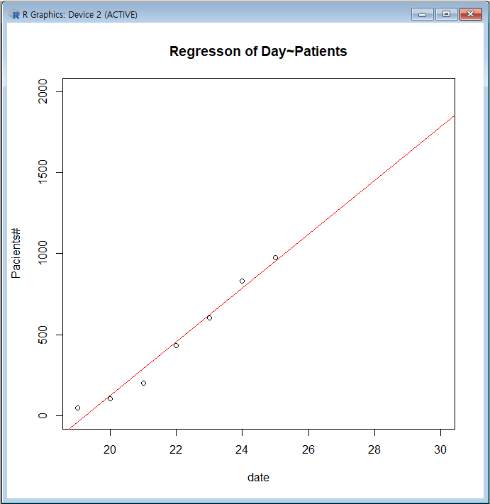

## 감염자수 
* 2월 19일 4 51
* 2월 20일 5 104
* 2월 21일 6 204
* 2월 22일 7 433
* 2월 23일 8 602
* 2월 24일 9 833
* 2월 25일10 977

y<-c(19:25)
v<-c(51,104,204,433,602,833,977)
plot(y,v)
lm(y ~ v)
f<- lm(v ~ y)
abline(f,col='red')
f
f$coefficients[[1]]
f$coefficients[[2]]
f$residuals #잔차
summary(f)
plot(y, v, xlim=c(19,30), ylim=c(0,1800), xlab = "date", ylab = "Pacients#") #25~30일 예측해 보기
abline(f, col='red')
title("Regresson of Day~Patients")

