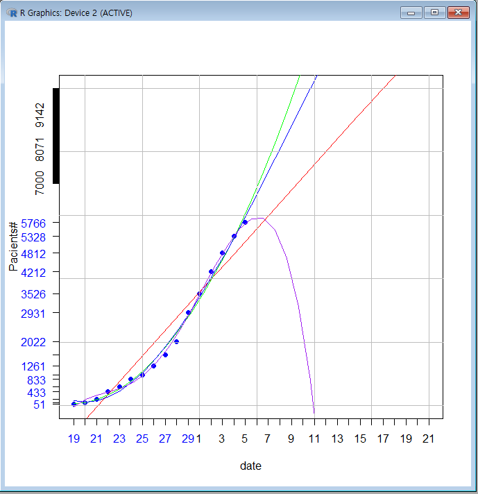

# Korean Corona19

|날자|인원|증감|사망자|결리해제|최종확진|
|---|---|---|---|---|---|
|2월 19일 | 51| 0 | | | |
|2월 20일 | 104| 53 | | | |
|2월 21일 | 204| 100 | | | |
|2월 22일 | 433| 229 | | | |
|2월 23일 | 602| 269 | | | |
|2월 24일 | 833| 231 | | | |
|2월 25일 | 977| 144 | | | |
|2월 26일 | 1261| 284 | | | |
|2월 27일 | 1766| 505 | | | |
|2월 28일 | 2337 | 571 | | | |
|2월 29일 | 3150 | 813 | | | |
|3월 1일 | 3736 | 586 | | | |
|3월 2일 | 4212 | 476 | | | |
|3월 3일 | 4812 | 600 | | | |
|3월 4일 | 5328 | 516 | 32 | | |
|3월 6일 | 5766 | 438 | 35 | 88 | 5678 |

# 선형예측  

    y<-c(51,104,204,433,602,833,977, 1261, 1595, 2022, 2931,3526,4212, 4812, 5328, 5766)
    x<-c(19:34)
    lm(x~y)
    #fit first degree polynomial equation:
    fit1<-lm(y ~ x)
#    fit1
#    fit1$coefficients[[1]]
#    fit1$coefficients[[2]]
#    fit1$residuals #잔차
    summary(fit1)
    title("Regresson of Day~Patients")
    plot(x, y,pch=19, xlim=c(19,50), ylim=c(0,10000), xlab = "date", ylab = "Pacients#", col="blue", yaxt='n', xaxt='n') #25~29, 1~3일 예측해 보기
    #first degree
#    abline(fit, col='red')
    #second degree
    fit2 <- lm(y~poly(x,2,raw=TRUE))
    #third degree
    fit3 <- lm(y~poly(x,3,raw=TRUE))
    #fourth degree
    fit4 <- lm(y~poly(x,4,raw=TRUE))
    #generate range of 31 numbers starting from 19 and ending at 50
    xx <- seq(19, 50, length=31)
    lines(xx, predict(fit1, data.frame(x=xx)), col="red")
    lines(xx, predict(fit2, data.frame(x=xx)), col="green")
    lines(xx, predict(fit3, data.frame(x=xx)), col="blue")
    lines(xx, predict(fit4, data.frame(x=xx)), col="purple")

    grid(lty=1, lwd=1, col='gray')

    axis(side=1, at=c(19:29), labels=c(19:29),col.axis="blue") #, lwd=2.5)
    axis(side=1, at=c(30:50), labels=c(1:21))#,col="red") #, lwd=2.5)

    axis(side=2, at=y, labels=y, col.axis="blue", las=2)
    axis(side=2, at=c(7000:10000), labels=c(7000:10000))#, col="red", col.axis="green)

[데이터 자료]

# [Tracking Coronavirus: map](https://bnonews.com/index.php/2020/02/the-latest-coronavirus-cases/)

## [중국, 한국 비교](https://www.fmkorea.com/2747110261)

# 사망률

1. China	2619	79204	3.306651179
2. Korean	8	833	0.960384154
3. Italy	6	223	2.69058296
4. Iran		12	47	25.53191489
			
5. Total	35	2392	1.463210702

* [curve fitting](https://davetang.org/muse/2013/05/09/on-curve-fitting/)

## 진단 키트 제조사
* 씨젠 - 천종윤
* SD바이오센서
* 솔젠트
