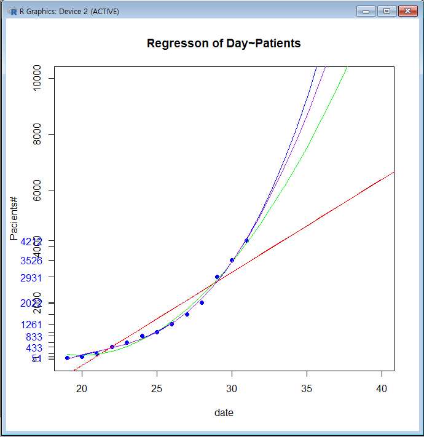

# Korean Corona19

|날자| 인원| 증감 |
|---|---|---|
|2월 19일 | 51| 0 |
|2월 20일 | 104| 53 |
|2월 21일 | 204| 100 |
|2월 22일 | 433| 229 |
|2월 23일 | 602| 269 |
|2월 24일 | 833| 231 |
|2월 25일 | 977| 144 |
|2월 26일 | 1261| 284 |
|2월 27일 | 1595| 427 |
|2월 28일 | 2022 | 427 |
|2월 29일 | 2931 | 909 | 
|3월 1일 | 3526 | 595 |
|3월 2일 | 4212 | 686 |

# 선형예측  
    x<-c(19:31)
    y<-c(51,104,204,433,602,833,977, 1261, 1595, 2022, 2931,3526,4212)
    plot(x,y)
    lm(x~y)
    #fit first degree polynomial equation:
    fit<-lm(y ~ x)
    abline(fit,col='red')
    fit
    fit$coefficients[[1]]
    fit$coefficients[[2]]
    fit$residuals #잔차
    summary(f)
    plot(x, y,pch=19, xlim=c(19,40), ylim=c(0,10000), xlab = "date", ylab = "Pacients#", col="blue") #25~30일 예측해 보기
    abline(fit, col='red')
    title("Regresson of Day~Patients")
    axis(2, at=y,labels=y, col.axis="blue", las=2)
    #second degree
    fit2 <- lm(y~poly(x,2,raw=TRUE))
    #third degree
    fit3 <- lm(y~poly(x,3,raw=TRUE))
    #fourth degree
    fit4 <- lm(y~poly(x,4,raw=TRUE))
    #generate range of 50 numbers starting from 30 and ending at 160
    xx <- seq(19, 40, length=27)
    #plot(x,y,pch=19,ylim=c(0,150))
    lines(xx, predict(fit, data.frame(x=xx)), col="red")
    lines(xx, predict(fit2, data.frame(x=xx)), col="green")
    lines(xx, predict(fit3, data.frame(x=xx)), col="blue")
    lines(xx, predict(fit4, data.frame(x=xx)), col="purple")
    
[데이터 자료]

# [Tracking Coronavirus: map](https://bnonews.com/index.php/2020/02/the-latest-coronavirus-cases/)

## [중국, 한국 비교](https://www.fmkorea.com/2747110261)

# 사망률

1. China	2619	79204	3.306651179
2. Korean	8	833	0.960384154
3. Italy	6	223	2.69058296
4. Iran		12	47	25.53191489
			
5. Total	35	2392	1.463210702

* [curve fitting](https://davetang.org/muse/2013/05/09/on-curve-fitting/)
